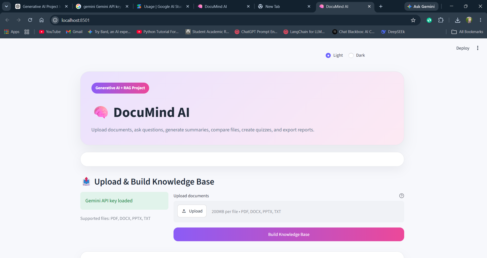
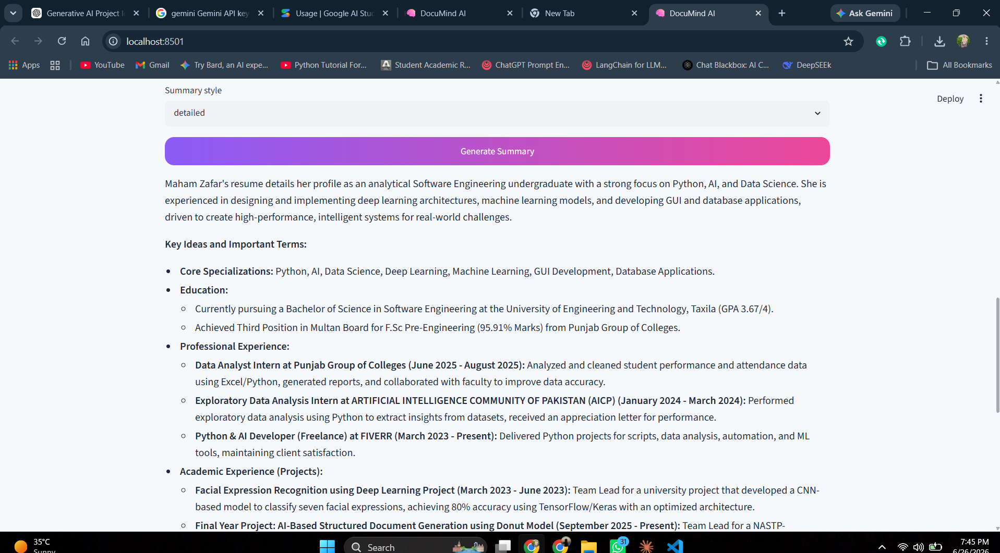
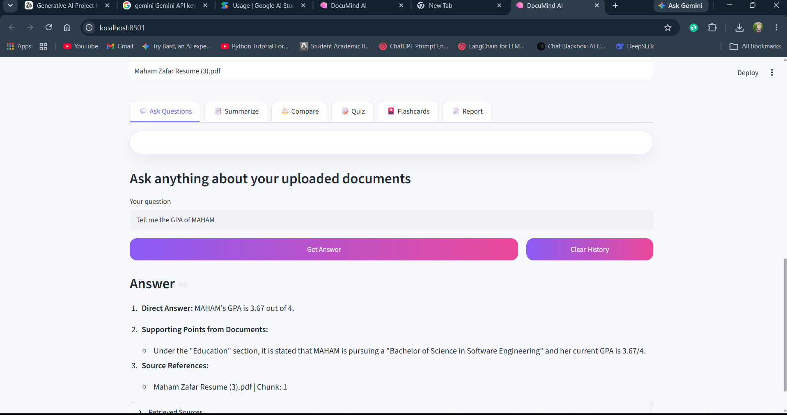

# 🧠 DocuMind AI
### Intelligent Multi-Document Analysis using Generative AI & Retrieval-Augmented Generation (RAG)


---

## 📖 Overview

**DocuMind AI** is an intelligent document analysis platform powered by **Google Gemini** and **Retrieval-Augmented Generation (RAG)**.

Instead of simply chatting with a PDF, DocuMind AI creates a searchable knowledge base from multiple uploaded documents, enabling users to ask natural language questions, generate summaries, compare documents, create quizzes, produce revision flashcards, and export AI-generated reports.

The project demonstrates practical applications of **Large Language Models (LLMs), Semantic Search, Document Intelligence, and Prompt Engineering**.

---

# ✨ Features

### 📂 Multi-Document Upload

Supports:

- PDF
- DOCX
- PPTX
- TXT

---

### 🧠 AI Question Answering

Ask questions like:

- What are the main objectives?
- Summarize Chapter 3.
- What technologies are used?
- Explain the methodology.

---

### 📑 Intelligent Summarization

Generate:

- Short Summary
- Detailed Summary
- Bullet Point Summary
- Executive Summary

---

### ⚖️ Document Comparison

Compare two or more uploaded documents to identify:

- Similarities
- Differences
- Missing Information
- Key Insights

---

### 📝 AI Quiz Generator

Automatically creates quizzes from uploaded documents.

---

### 🎴 Flashcard Generator

Creates revision flashcards for quick learning.

---

### 📊 Interactive Dashboard

Displays:

- Uploaded Documents
- Indexed Chunks
- Questions Asked

---

### 📄 PDF Report Generation

Download AI-generated responses as professional PDF reports.

---

### 🌗 Modern User Interface

- Responsive Layout
- Light Theme
- Dark Theme
- Clean Dashboard
- Professional Cards

---

# 🏗️ Project Architecture

```
                    Upload Documents
                           │
                           ▼
                 Text Extraction Engine
                           │
                           ▼
                   Text Chunking
                           │
                           ▼
                  Embedding Generation
                           │
                           ▼
                 Local Vector Database
                           │
                           ▼
                  Semantic Search (RAG)
                           │
                           ▼
                   Google Gemini API
                           │
                           ▼
                  AI Generated Response
```

---

# 🛠️ Tech Stack

| Category | Technology |
|-----------|------------|
| Programming Language | Python |
| Frontend | Streamlit |
| Generative AI | Google Gemini API |
| RAG | Local Retrieval-Augmented Generation |
| Embeddings | Sentence Transformers |
| Document Processing | PyMuPDF, python-docx, python-pptx |
| Data Processing | Pandas |
| Report Generation | ReportLab |

---

# 📂 Project Structure

```
DocuMindAI/
│
├── app.py
├── requirements.txt
├── README.md
├── .env.example
│
├── src/
│   ├── config.py
│   ├── document_loader.py
│   ├── gemini_client.py
│   ├── prompts.py
│   ├── rag_engine.py
│   ├── report_generator.py
│
├── reports/
│
└── assets/
```

---

# ⚙️ Installation

## Clone Repository

```bash
git clone https://github.com/YOUR_USERNAME/DocuMind-AI.git

cd DocuMind-AI
```

---

## Create Virtual Environment

### Windows

```bash
python -m venv venv

venv\Scripts\activate
```

### Linux / macOS

```bash
python3 -m venv venv

source venv/bin/activate
```

---

## Install Dependencies

```bash
pip install -r requirements.txt
```

---

# 🔑 Configure Environment Variables

Create a `.env` file.

```env
GEMINI_API_KEY=YOUR_GEMINI_API_KEY
```

You can obtain a free API key from **Google AI Studio**.

---

# ▶️ Run the Application

```bash
streamlit run app.py
```

---

# 💡 Example Use Cases

- Research Paper Analysis
- Resume Analysis
- University Lecture Notes
- Company Policy Documents
- Legal Documents
- HR Documentation
- Technical Documentation
- Exam Preparation

---

# 📸 Application Screenshots


## 📊 Dashboard



---

## 📑 AI Summary



---
## 📑 AI Chat



---


# 🚀 Future Enhancements

- User Authentication
- Chat History
- Cloud Database
- OCR Support
- Voice Assistant
- Multi-language Support
- Citation-Based Responses
- Cloud Deployment
- AI Agent Workflow

---


# 👩‍💻 Author

## Maham Zafar

Software Engineering Graduate

AI | Machine Learning | Generative AI | Python Developer

GitHub: https://github.com/Maham-zafar123

LinkedIn: https://linkedin.com/in/maham-zafar-84695726b/

---

# ⭐ If you found this project useful, consider giving it a star!
